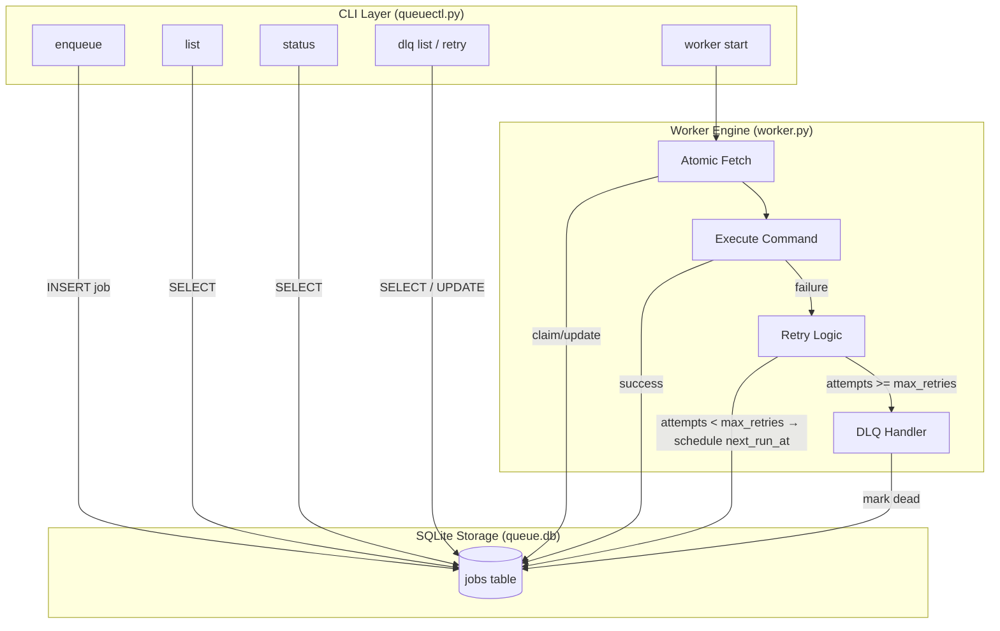
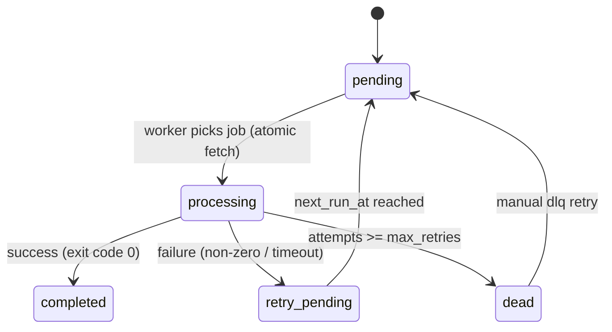

# QueueCTL – System Design Document

## 1. Introduction
> QueueCTL is a lightweight, CLI-based background job processing system designed for reliability, determinism, and simplicity.
> It supports enqueueing jobs, running worker processes, retrying failures with exponential backoff, and a Dead Letter Queue (DLQ) for permanently failed jobs.
> All state is persisted using SQLite so job progress and failures survive restarts.

---

## 2. High-Level Architecture
> The high-level architecture consists of three layers:
> 1. CLI Layer (`queuectl.py`) – user-facing commands for job and worker management.
> 2. Worker Engine (`worker.py`) – performs atomic fetch, execution, retry, and DLQ transitions.
> 3. SQLite Storage (`queue.db`) – persists durable job state across restarts.
>
> The diagram below illustrates interactions among these components.

---

## 3. Core Components

### 3.1 CLI Layer (`queuectl.py`)
Handles enqueueing, listing, status reporting, worker start, and DLQ commands.

### 3.2 Storage Layer (`database.py`)
Creates and maintains the SQLite database. Ensures schema consistency and persists all job states and timestamps.

### 3.3 Worker Engine (`worker.py`)
Executes jobs, performs atomic claiming, handles retries, computes backoff, and transitions jobs into DLQ when retries exceed limits.

---

## 4. Job Lifecycle

---

## 5. Job Lifecycle (Detailed Explanation)

1. pending  
   Job inserted or eligible to run (`next_run_at <= now`).

2. processing  
   Worker atomically locks job using `BEGIN IMMEDIATE` and executes the command.

3. completed  
   Job executed successfully.

4. failed → retry  
   Non-zero exit code (or timeout) triggers:
   - increment attempts
   - compute backoff delay
   - update `next_run_at`
   - return to pending (via `retry_pending`)

5. dead (DLQ)  
   If `attempts >= max_retries`, job is moved to DLQ.

6. DLQ Retry  
   Manual command resets attempts and marks job pending again.

---

## 6. Persistence Strategy

- SQLite chosen for durability and simplicity.
- `BEGIN IMMEDIATE` ensures atomic job claiming across multiple workers.
- `next_run_at` supports retry scheduling and delayed execution.
- No state is lost on worker restart.

---

## 7. Concurrency Strategy

Even though the system currently uses a single worker, the design is concurrency-safe.

Key protections:
- `BEGIN IMMEDIATE` locks write access, preventing multiple workers from claiming the same job.
- State updates occur in the same transaction as the job fetch.
- Worker only selects jobs whose `next_run_at <= datetime('now')`.
This ensures correctness even under multiple workers.

---

## 8. Error Handling & Resilience

- Non-zero exit codes → retry
- Timeouts → retry
- Attempts exceeding limit → DLQ
- All transitions logged
- Timestamps updated on every state change

---

## 9. Configuration

- `max_retries`: per-job config
- `BACKOFF_BASE_SECONDS`: exponential backoff base (default 3 seconds)
- `COMMAND_TIMEOUT_SECONDS`: default 30 seconds
- `next_run_at`: computed per-attempt

---

## 10. Testing Strategy

### 10.1 Demo Script (`scripts/demo.ps1`)
Automates:
- Enqueueing jobs
- Running worker
- Triggering retries and DLQ transitions
- DLQ recovery
- Final state display

### 10.2 Manual Tests
- Multiple enqueues
- Restart worker after failure
- Invalid command behavior
- Persistence verification
- Backoff scheduling check

---

## 11. Trade-offs & Future Enhancements

### Trade-offs
- SQLite chosen for simplicity; not ideal for distributed systems.
- Worker is single-threaded; does not use multiprocessing.
- Shell commands executed directly; no isolation.

### Future Enhancements
- Priority queue support
- Scheduled jobs (`run_at`)
- Separate stdout/stderr log files per job
- Minimal web dashboard
- REST API wrapper
- Worker pool with multiprocessing

---

## 12. Conclusion

QueueCTL fulfills all core requirements:
- ✅ Enqueue jobs
- ✅ Worker execution
- ✅ Exponential retries
- ✅ DLQ handling
- ✅ Atomic fetch (no duplicates)
- ✅ Persistent storage
- ✅ CLI interface
